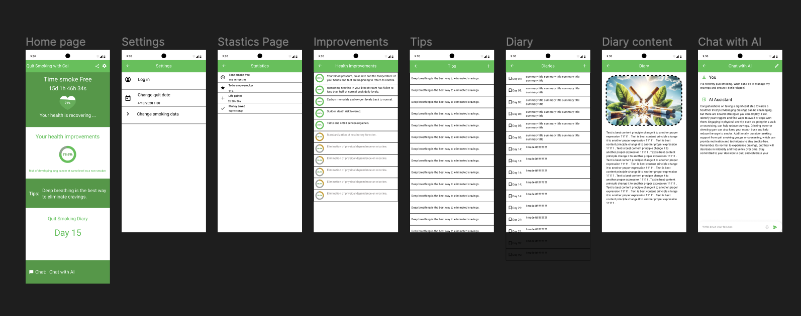
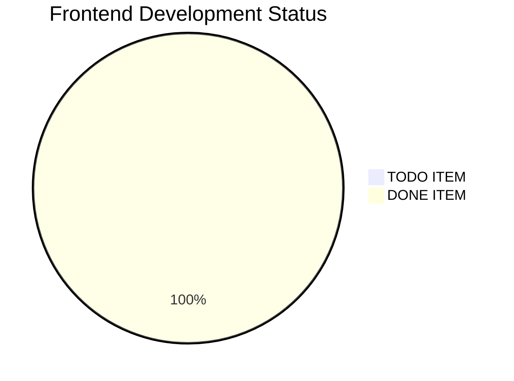
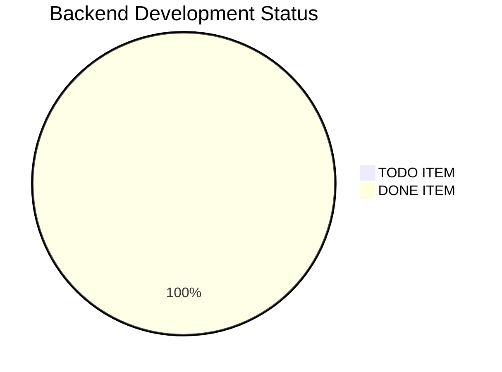

# 1. Goal for 2024

## Help 100 people to quit smoking in 2024
I‘ve successfully quit smoking since 04/10/2020 01:30. I feel physically lighter and mentally joyful.  I hope you can experience this sense of happiness just as I have. I believe this project can change many people's lives, truly helping others. Therefore, this is the most worthwhile thing for me to devote my energy to at the moment. My goal for 2024 is to **help 100 people successfully quit smoking**.

# 2. Plan
Design a very simple and easy-to-use APP: Quit Smoking with Cai, by which I can share my successfully quit smoking experience since 04/10/2020 01:30. It must be minimalist, too many features can actually be frustrating. It will have 5 major functions:
1. **Statistics** - Display your smoke free time and money saved
2. **Improvements** - Your health improvements
3. **Tips** - tips can motivate you when you are craving.
4. **Dairy** - write down whatever you want
5. **Chat with AI** - let AI help you whatever you need

# 3. Design

See each screen details in pdf: [./materials/QuitSmokingwithCai.pdf](./materials/QuitSmokingwithCai.pdf)

# 4. Development
## Frontend
Flutter

## Backend
Firebase

# 5. Publishment
## iOS - App Store

## Android - Play Store(in progress...)

Google Play Store: [https://play.google.com/store/apps/details?id=com.caiyongji.quitsmokingwithcai.quitsmokingwithcai](https://play.google.com/store/apps/details?id=com.caiyongji.quitsmokingwithcai.quitsmokingwithcai)

# 6. See other projects in [one-person business with AI](https://github.com/caiyongji/one-person-business-with-AI?tab=readme-ov-file) 

